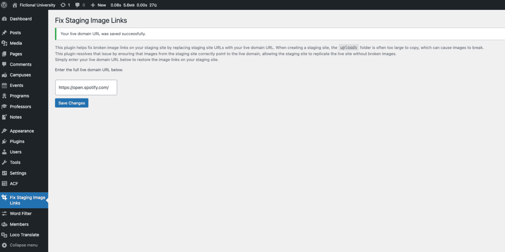

# Fix Staging Image Links Plugin

[](https://wordpress.org/)
[](https://www.php.net/)
[](https://developer.wordpress.org/plugins/)

> **Fix Staging Image Links Plugin** is a simple plugin designed to help fix broken image links on your staging WordPress site by replacing staging site URLs with your live domain URL. It ensures that images from the staging site are correctly linked to the live domain without needing to copy the large uploads folder.



## 🚀 Features

- **Fix Staging Image Links:** Automatically replaces staging image URLs with live domain URLs.
- **Simple Setup:** Just enter your live domain URL to start fixing broken image links.
- **No Need to Copy Uploads Folder:** Avoid copying large folders by linking staging images to the live domain.
- **Admin Interface:** Manage your live URL settings from the WordPress admin panel.
- **Seamless Integration:** The plugin works in the background to fix image URLs without affecting performance.

## 🛠️ Technologies Used

- **WordPress API**
- **PHP 8.1+**
- **JavaScript** for DOM manipulation
- **HTML & CSS** for user interface elements

## 🔧 Installation

1. Clone or download this repository:
    ```bash
    git clone https://github.com/jarutosurano/wpplugin-fix-staging-image-links.git
    ```
2. Place the plugin folder inside the WordPress `wp-content/plugins` directory.
3. Activate the plugin in the WordPress admin panel under `Plugins > Installed Plugins`.

## 🧩 How to Use

1. Once activated, go to `Fix Staging Image Links` in the WordPress admin menu.
2. Enter your live domain URL in the provided field (e.g., `https://www.example.com`).
3. Save the settings.
4. The plugin will automatically replace all staging image URLs with your live domain URL, fixing any broken image links on the staging site.

## 📖 License

This plugin is licensed under the GPLv2 or later. See the [LICENSE](LICENSE) file for more details.

## 💬 Feedback

Feedback, bug reports, and feature suggestions are welcome!  
📧 Email me at [jarutosurano@gmail.com](mailto:jarutosurano@gmail.com) or open an [issue](https://github.com/jarutosurano/wpplugin-fix-staging-image-links/issues).

---

*Let's make WordPress a better place, one plugin at a time!*
